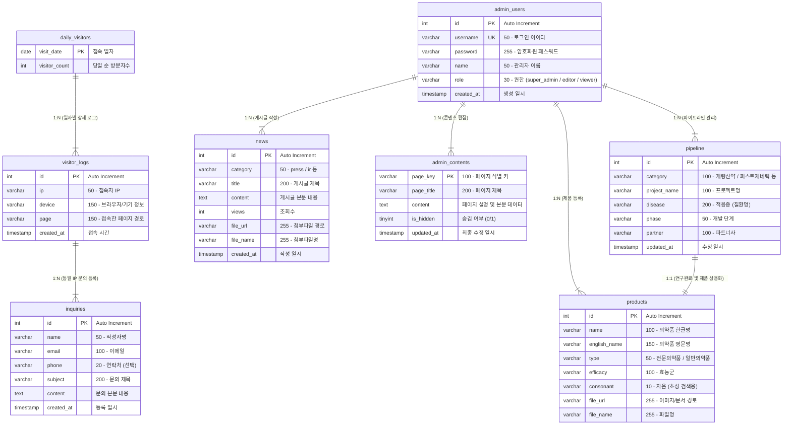

# 다산제약 홈페이지 데이터베이스 ERD (Entity Relationship Diagram)

다산제약 홈페이지 데이터베이스 스키마의 전체 테이블 설계도입니다. 각 테이블은 서비스 컴포넌트(문의 접수, 게시판, 제품/R&D 관리, 방문자 로그, 관리자 계정)별로 독립적이면서 유기적으로 결합되어 있습니다.

---

## 🔗 테이블 간 관계 및 차수 (1:N / 1:1) 상세 설명

다산제약 홈페이지 데이터베이스 스키마는 웹 성능과 단순 관리를 고려하여 물리적 외래키(Foreign Key) 제약 조건이 명시적으로 설정되어 있지 않은 플랫(Flat)한 구조이지만, 서비스 운영 흐름상 다음과 같은 **1대다 (1:N) 및 1대1 (1:1) 관계**를 개념적으로 지니고 있습니다.

### 1. 1대다 (1:N) 관계

*   **`daily_visitors` (1) : `visitor_logs` (N)**
    *   **설명:** 1개의 일자별 통계 레코드(1)에 대해 해당 날짜 동안 발생한 다수의 실시간 접속 로그(N)가 연결됩니다.
    *   **조인 기준:** `daily_visitors.visit_date` = `DATE(visitor_logs.created_at)`
*   **`admin_users` (1) : `news` (N)**
    *   **설명:** 1명의 관리자(1)는 뉴스룸에 다수의 보도자료 및 공시 정보 게시글(N)을 등록하고 편집할 수 있습니다.
*   **`admin_users` (1) : `admin_contents` (N)**
    *   **설명:** 1명의 관리자(1)는 회사 소개 및 연구소 소개 등 여러 페이지의 정적 텍스트와 SEO 설정(N)을 개별적/독립적으로 제어합니다.
*   **`admin_users` (1) : `products` (N)**
    *   **설명:** 1명의 관리자(1)는 제품 검색 페이지에 노출될 여러 의약품 정보(N)를 데이터베이스에 추가하고 갱신합니다.
*   **`admin_users` (1) : `pipeline` (N)**
    *   **설명:** 1명의 관리자(1)는 신약 개발 현황판에 나열될 다수의 연구 과제(N)를 기획하고 업데이트합니다.
*   **`visitor_logs` (1) : `inquiries` (N)**
    *   **설명:** 동일한 접속 IP를 가진 1명의 방문자(1)가 홈페이지 이용 도중 다수의 1:1 문의, 영업 문의, 제품 문의(N)를 남길 수 있습니다.
    *   **조인 기준:** `visitor_logs.ip` = `inquiries.email` (또는 동일한 IP 및 디바이스 환경 조건)

### 2. 1대1 (1:1) 관계

*   **`pipeline` (1) : `products` (1)**
    *   **설명:** 다산제약 R&D 연구 단계에 등록되어 개발이 완료된 1개의 신약/제네릭 과제(1)는 최종 임상 및 허가를 통과하면, 1개의 상용화된 완제 의약품(1)으로 제품 데이터베이스에 새롭게 등록됩니다.
    *   **조인 기준:** `pipeline.project_name` = `products.name` (연구 프로젝트 명칭과 제품 상표명이 일치하는 경우 연결)

### 1. 고객 문의 및 접수 그룹
*   **`inquiries`**: 1:1 문의, 영업 문의, 제품 문의 및 부패신고(익명) 접수 내용을 모두 통합 관리하는 테이블입니다. `subject` 컬럼의 접두사(`[제품 문의]`, `[부패신고 문의]`)를 기준으로 구분합니다.

### 2. 콘텐츠 및 R&D/제품 정보 그룹
*   **`news`**: 홈페이지의 뉴스룸(보도자료, 홍보자료) 및 주주 정보 콘텐츠를 담는 게시판 테이블입니다.
*   **`pipeline`**: R&D 연구 단계(기초연구, 전임상, 임상 1~3상 등) 현황판의 정보를 관리합니다.
*   **`products`**: 전문의약품/일반의약품의 초성 및 카테고리 검색을 위한 품목 관리 테이블입니다.
*   **`admin_contents`**: 회사 소개나 시설 소개 등 동적 편집이 필요한 텍스트 및 각 페이지별 SEO 메타데이터(타이틀, 키워드, 설명)를 동적으로 관리하는 공통 스토리지입니다.

### 3. 방문자 통계 및 접속 로그 그룹
*   **`visitor_logs`**: 실시간 접속한 사용자의 유입 경로와 기기 형태(모바일, 태블릿, PC 등)를 즉각 수집합니다.
*   **`daily_visitors`**: `visitor_logs`를 기반으로 가공되어 매일 집계되는 일별 유니크 방문자 요약 통계 테이블입니다.

### 4. 시스템 관리 그룹
*   **`admin_users`**: 관리자 사이트의 로그인 세션을 제어하는 계정 정보로, 슈퍼관리자(모든 권한), 콘텐츠 관리자(읽기/쓰기), 단순 조회자(읽기 전용) 등으로 권한(`role`)을 분할하여 접근 권한을 보안 통제합니다.
