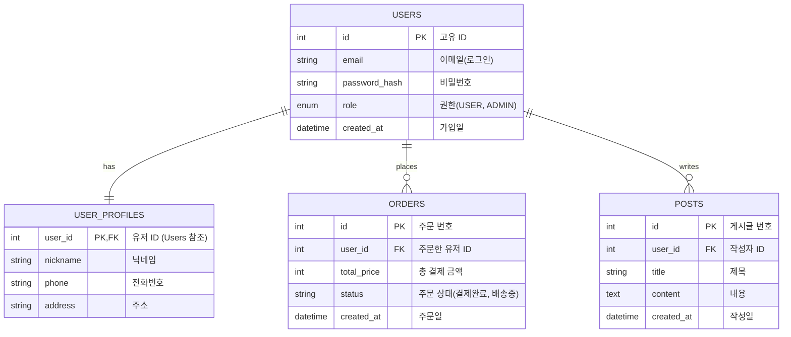

# 사용자 페이지 및 관리자 페이지 전체 설계도

이 설계도는 웹 서비스(예: 쇼핑몰, 커뮤니티, SaaS 등)의 가장 표준적인 구조를 바탕으로 작성되었습니다. 서비스의 성격에 따라 구체적인 기능은 추가되거나 수정될 수 있습니다.

## 1. 사용자 페이지 (User Pages) 설계

사용자 페이지는 일반 고객이 서비스를 탐색하고, 이용하며, 자신의 정보를 관리하는 공간입니다.

### 1.1 주요 메뉴 및 기능 흐름
*   **메인 페이지 (Home)**
    *   주요 서비스/상품 하이라이트 배너
    *   최근 게시물 또는 추천 상품 리스트
*   **인증 (Authentication)**
    *   **로그인 / 회원가입**: 이메일, 소셜 로그인(OAuth)
    *   비밀번호 찾기 / 재설정
*   **서비스 이용 페이지 (도메인에 따라 다름)**
    *   **상품/게시물 목록**: 필터링, 정렬, 페이징 기능
    *   **상세 페이지**: 정보 확인, 리뷰/댓글 작성, 장바구니 담기, 찜하기 등
*   **마이페이지 (My Page)**
    *   **프로필 관리**: 개인정보 수정, 프로필 이미지 변경 (회원과 1:1 관계)
    *   **이용 내역**: 주문 내역, 작성한 게시물, 결제 내역 (회원과 1:N 관계)
    *   **고객 센터**: 1:1 문의 내역, FAQ 확인

---

## 2. 관리자 페이지 (Admin Pages) 설계

관리자 페이지는 서비스 운영자가 사용자 데이터를 관리하고, 콘텐츠를 제어하며, 통계를 확인하는 공간입니다. (보안과 권한 관리가 매우 중요합니다.)

### 2.1 주요 메뉴 및 기능 흐름
*   **대시보드 (Dashboard)**
    *   핵심 성과 지표(KPI): 일일 가입자 수, 총매출, 활성 사용자 수(DAU)
    *   최근 발생한 중요 알림 (새로운 문의, 재고 부족 등)
*   **회원 관리 (User Management)**
    *   회원 목록 조회, 검색, 필터링
    *   회원 상세 정보 보기, 권한(일반/관리자/정지) 변경
*   **콘텐츠/상품 관리 (Content Management)**
    *   콘텐츠(상품/게시글) 등록, 수정, 삭제(CRUD)
    *   카테고리 및 태그 관리
*   **결제 및 주문 관리 (Order Management)** (쇼핑몰/유료 서비스인 경우)
    *   전체 결제 내역, 환불 처리, 배송 상태 변경
*   **고객 지원 (Customer Support)**
    *   사용자의 1:1 문의 답변 작성
    *   공지사항 및 FAQ 관리

---

## 3. 데이터베이스 ERD (1:1, 1:N 관계 포함)

사용자와 프로필 간의 **1:1 관계**, 사용자와 활동(주문, 게시글) 간의 **1:N 관계**를 보여주는 핵심 DB 설계입니다.

*(참고: VS Code의 기본 마크다운 뷰어는 그림(Mermaid)을 지원하지 않아 코드로만 보일 수 있습니다. 이를 위해 마크다운 전용 표(Table)를 함께 추가했습니다.)*

### 3.1 텍스트 표(Table)로 보기

#### 1) USERS (사용자)
| 컬럼명 | 데이터 타입 | 제약조건 | 설명 |
|---|---|---|---|
| id | int | PK | 고유 ID |
| email | string | | 이메일(로그인) |
| password_hash | string | | 비밀번호 |
| role | enum | | 권한(USER, ADMIN) |
| created_at | datetime | | 가입일 |

#### 2) USER_PROFILES (사용자 프로필 - USERS와 1:1 관계)
| 컬럼명 | 데이터 타입 | 제약조건 | 설명 |
|---|---|---|---|
| user_id | int | PK, FK | 유저 ID (USERS 테이블 참조) |
| nickname | string | | 닉네임 |
| phone | string | | 전화번호 |
| address | string | | 주소 |

#### 3) ORDERS (주문 내역 - USERS와 1:N 관계)
| 컬럼명 | 데이터 타입 | 제약조건 | 설명 |
|---|---|---|---|
| id | int | PK | 주문 번호 |
| user_id | int | FK | 주문한 유저 ID (USERS 참조) |
| total_price | int | | 총 결제 금액 |
| status | string | | 주문 상태(결제완료, 배송중 등) |
| created_at | datetime | | 주문일 |

#### 4) POSTS (게시글 - USERS와 1:N 관계)
| 컬럼명 | 데이터 타입 | 제약조건 | 설명 |
|---|---|---|---|
| id | int | PK | 게시글 번호 |
| user_id | int | FK | 작성자 ID (USERS 참조) |
| title | string | | 제목 |
| content | text | | 내용 |
| created_at | datetime | | 작성일 |

---

### 3.2 다이어그램(그림) 코드로 보기
*(VS Code에서 그림으로 보시려면 확장 프로그램 탭에서 `Markdown Preview Mermaid Support`를 설치하시면 됩니다.)*

